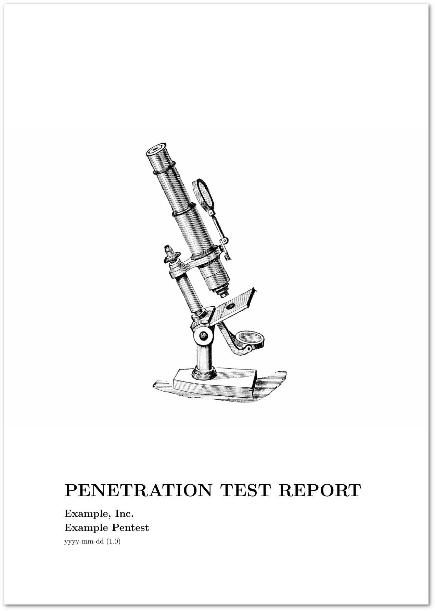

# report generator

Create beautiful pentest reports from Markdown documents.

<a href="results/report.pdf"></a>

## requirements

Install Jinja2:

```text
$ python3 -m pip install Jinja2
```

Install TeX Live (full) and Pandoc:

```text
$ sudo apt install texlive-full pandoc
```

## usage

1. modify `project.yaml`
2. conduct pentest
3. document findings in `report/issues/<issue title>.md`
  * put screenshots right next to the issue file
  * you can structure a pentest into groups: put the issues into folders (e.g. `report/issues/1 - EXAMPLE/`)
4. add vulnerability templates to `report/vulnerabilities/`
5. fill *required info*, *provided info*, *tools*, *limitations* and *summary* documents
6. create the PDF report

```text
$ ./report.py -h
usage: report.py [-h] [-o] [-v]

options:
  -h, --help       show this help message and exit
  -o, --overwrite  overwrite the LaTeX document
  -v, --verbose    be very verbose
```

## credits

* [image for the title page](https://www.oldbookillustrations.com/illustrations/microscope/)
